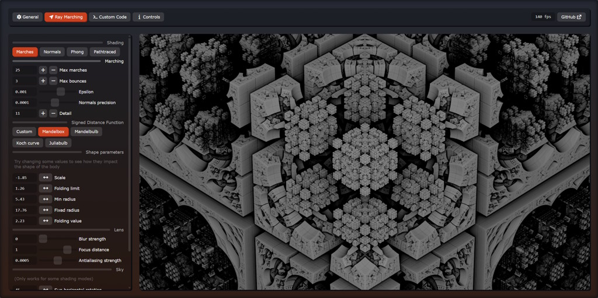
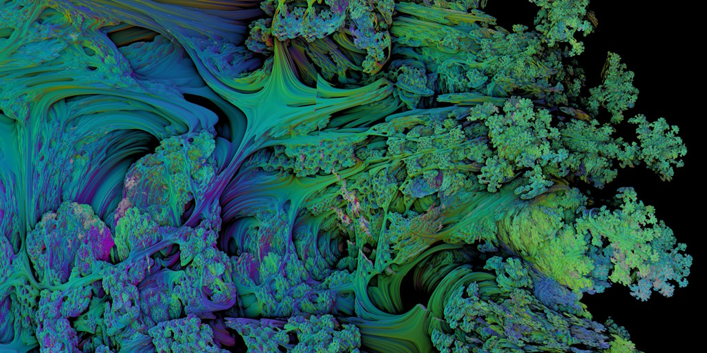
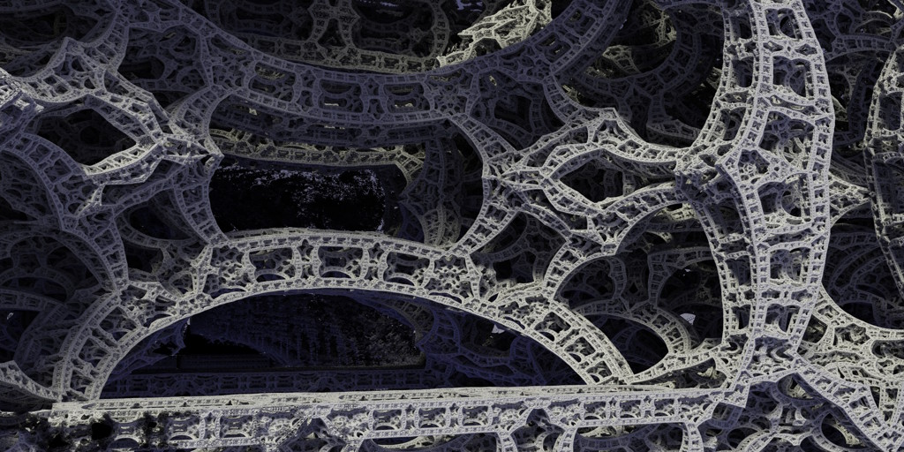
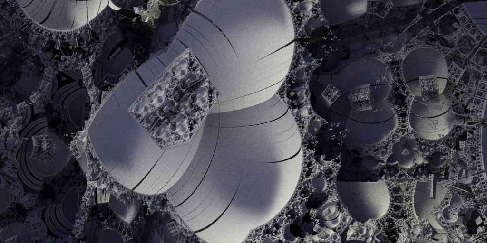

---

### WebGL2 Fractal Raymarcher 

This is a browser fractal renderer made for a university bachelor thesis. As the title says, it uses the WebGL2 graphics library. It is available through the link below (*might not work on some devices*).

> https://martzin23.github.io/webgl2-fractal-raymarcher/

---

### Screenshots

#### User interface

#### Mandelbulb with normals

#### Mandelbox with path tracing

#### Mandelbox with path tracing

---